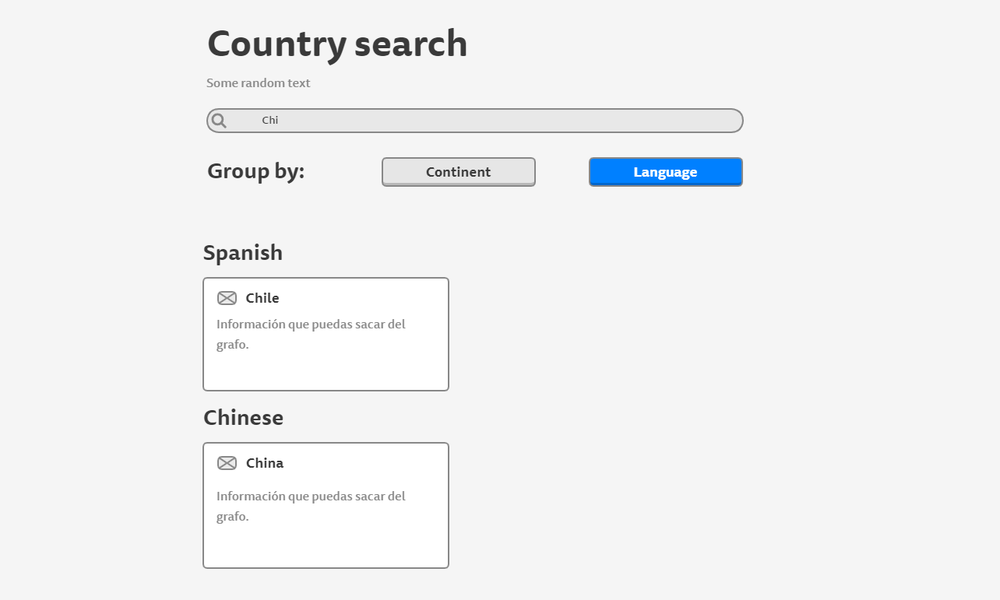
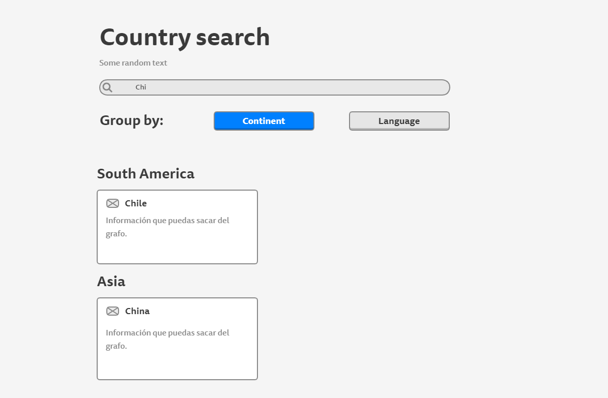

# Desafío para Software Engineers

## Instrucciones

Debes crear un buscador de países consultando el [siguiente grafo](https://countries.trevorblades.com/). Este repositorio contiene una base de código para seguir con la aplicación en React y ApolloClient. Queda a disposición tuya cualquier cambio, ya sea de estructura, estilo, etc.

Se espera que logres hacer una aplicación parecida a la del siguiente diagrama:

La funcionalidad y estructura debe ser igual, pero el diseño y variantes (por ejemplo, cambiar colores de las cosas) queda a tu gusto. **Considerar que el ícono al lado del nombre de cada país es el emoji**.

## Consideraciones

Se espera que uses buenas prácticas como gitflow, orden del código, estructura, eficiencia, etc.
Puedes dejar comentarios de decisiones que tuviste que tomar y del por qué en este repositorio.

## Hints

Acá van algunas cosas que pueden ser útiles (o no 👀):

- [Gitignore](https://www.toptal.com/developers/gitignore)
- [GraphQL](https://www.howtographql.com/)
- [React](https://es.reactjs.org/)
- [Styled components](https://styled-components.com/docs/basics)
- [ApolloClient](https://www.apollographql.com/docs/react/)
- [Lodash](https://lodash.com/)
- [Conventional commits](https://www.conventionalcommits.org/en/v1.0.0/)
- [Commitlint](https://commitlint.js.org/#/)
- [Eslint](https://eslint.org/)
- [Eslint airbnb](https://www.npmjs.com/package/eslint-config-airbnb)
- [Husky](https://www.npmjs.com/package/husky)

## Respuesta Teórica

Dado la interrogante: 
> "La tabla que contiene la información correspondiente a la asistencia diaria de un niño en un colegio tiene 90 millones de filas. Todas las tablas del sistema existen en la misma BDD en MySQL. La lógica del backend que actualiza la información correspondiente al pasar la asistencia tiene un tiempo de servicio p95 de 10 segundos. El equipo está interesado en bajar este tiempo para mejorar la experiencia del usuario (y porque nos gusta pensar en Kimche como un Ferrari). ¿Que propondrías para enfrentar el problema? Esta pregunta es abierta, no hay respuestas malas. Puedes proponer arquitectura, tecnologías, diseño, etc."

Responderé diferentes formas de atacar el problema, estas pueden combinarse o no entre sí, pero todas apuntan a mejoras la eficacia de la respuesta del servidor al clinte al hacerle una consulta a la base de datos:

1) **Cambio de la BDD**: MySQL es un sistemna relacional de BDD que funciona sobre SQL y tiene mutiples beneficios de al usarse en la nube. Pero resulta que la eficiencia al hacer las consultas sobre una base de datos rerlacional no siempre es optima y depende de lo que quieras buscar. Para este caso una mejor alternativa sería migrar toda la base de datos a una no relacional que que funcione bien en la nube (tal como la anterior), para esto podemos usar MongoDB. El tema es que migrar toda la base de datos es algo muy costoso y si lo vamos a hacer hay que estar seguros de que definitvamente es la mejor opcion y no empeora notablemente alguna otra funcionidad de los serrvicios de Kimche.

2) **Mejorar la forma en la quer se hace la consulta**: A lo mejor se hace la consultas de una forma anidada o algun otro metodo poco eficiente que hace que se deba itera por **n** veces por las 90.000.000 de filas. Si se mejora la consultas o se usa una ORM o directamente algo como GraphQL, sería mucha más eficiente.

3) **Cambiar la estrategia del caché**: Utilizar la estrategia [stale-white-revalidation](https://www.infoq.com/news/2020/11/ux-stale-while-revalidate/#:~:text=stale%2Dwhile%2Drevalidate%20helps%20developers,are%20used%20in%20the%20future.&text=The%20response%20to%20the%20revalidation,stale%20response%20in%20the%20cache.). En palbras muy simples lo que hace esta tecnica es actualizar el cache local donde se ejecuto la orden para luego pasar al servidor. De esta forma el usuario vería una solución inmediata a pesar de que en el servidor tarde unos segundos más en actualizarse. Así se satisface al usuario con una "solucion parche" bastante buena, viable, eficiente y no tan costosa.

